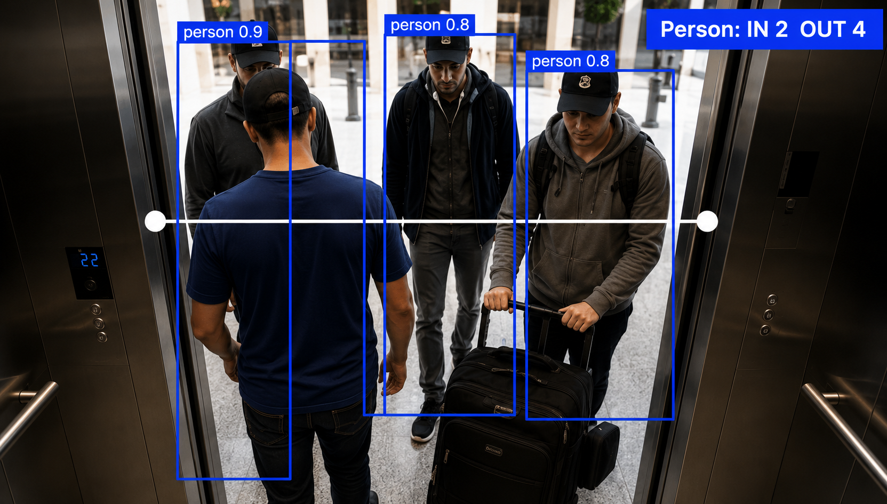

# Elevator People Counter (In/Out Line Counting)

Real-time people counting for elevators using a virtual line — tracks how many people enter and exit by detecting crossings of a defined line in the camera feed, powered by Ultralytics YOLO26.


## Demo





## Features

- Real-time person detection and tracking using [Ultralytics YOLO26](https://docs.ultralytics.com/)
- Built on Ultralytics' [`ObjectCounter`](https://docs.ultralytics.com/guides/object-counting/) solution — no custom counting logic needed
- Configurable virtual line to match your camera's elevator door position
- Live preview window while processing
- Annotated output video saved to disk with in/out counts overlaid

## How It Works

1. Each frame is read from the elevator camera feed (or a recorded video).
2. The frame is passed to `ObjectCounter`, which runs YOLO26 detection + tracking restricted to the `person` class.
3. Whenever a tracked person crosses the defined `line_points`, they're counted as **In** or **Out** depending on direction of travel.
4. The annotated frame (with boxes, track IDs, and running counts) is written to the output video and shown live.

## Requirements

- Python 3.9+
- A video feed or recording of the elevator entrance/doorway

Install dependencies:

```bash
pip install -r requirements.txt
```

## Setup

1. **Clone the repository**

   ```bash
   git clone https://github.com/<your-username>/<your-repo>.git
   cd <your-repo>
   ```

2. **Add your video**

   Place your elevator camera feed/recording in the project root (or a `videos/` folder), and update `VIDEO_SOURCE` in `elevator_counter.py` accordingly.

3. **Set the counting line**

   Adjust `line_points` in `elevator_counter.py` to match the position of the elevator door in your specific footage:

   ```python
   line_points = [(100, 400), (1180, 400)]
   ```

   Tip: pause on a single frame and check pixel coordinates (e.g. with `cv2.imshow` + mouse callback, or any image viewer) to line it up precisely with the doorway.

4. **Run**

   ```bash
   python elevator_counter.py
   ```

   The model weights (`yolo26n.pt`) will be downloaded automatically by Ultralytics on first run if not already present.

## Output

- `elevator_monitoring.avi` — annotated video with bounding boxes, track IDs, and running In/Out counts
- Uncomment the print statement in the main loop to log real-time counts to the console:

  ```python
  print(f"Total In: {counter.in_counts} | Total Out: {counter.out_counts}")
  ```

## Configuration

| Setting | Location | Description |
|---|---|---|
| `VIDEO_SOURCE` | Top of script | Path to your input video, or `0` for a live webcam feed |
| `line_points` | Top of script | Two (x, y) coordinates defining the virtual counting line |
| `model="yolo26n.pt"` | `ObjectCounter(...)` | Pretrained model variant — swap for `yolo26s.pt`, `yolo26m.pt`, etc. for higher accuracy at the cost of speed |
| `classes=[0]` | `ObjectCounter(...)` | Restricts detection to the `person` class (COCO class 0) |
| `show=True` | `ObjectCounter(...)` | Set to `False` to disable the live preview window (useful for headless/server runs) |

## Project Structure

```
.
├── elevator_counter.py    # Main script
├── requirements.txt       # Python dependencies
├── .gitignore
└── videos/                # (not tracked) input videos go here
```

## Known Limitations

- Counting accuracy depends on line placement and camera angle — a low, oblique angle can cause missed or duplicate crossings.
- Occlusion in crowded elevators (multiple people entering close together) may affect tracking and counting accuracy.
- Model weights are auto-downloaded on first run, which requires an internet connection.

## License

This project is licensed under the MIT License — see [LICENSE](LICENSE) for details.
